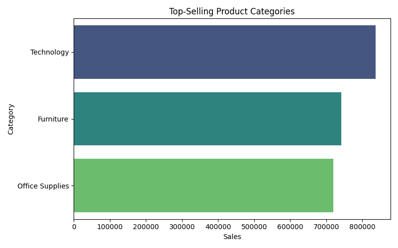
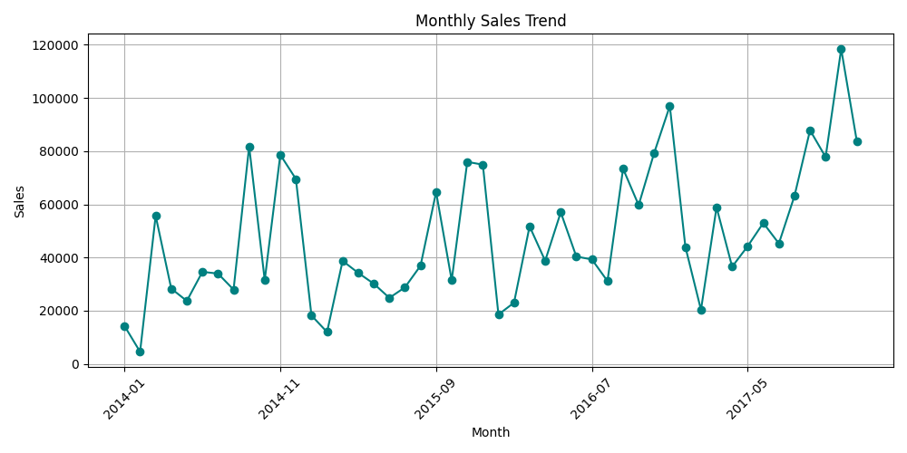
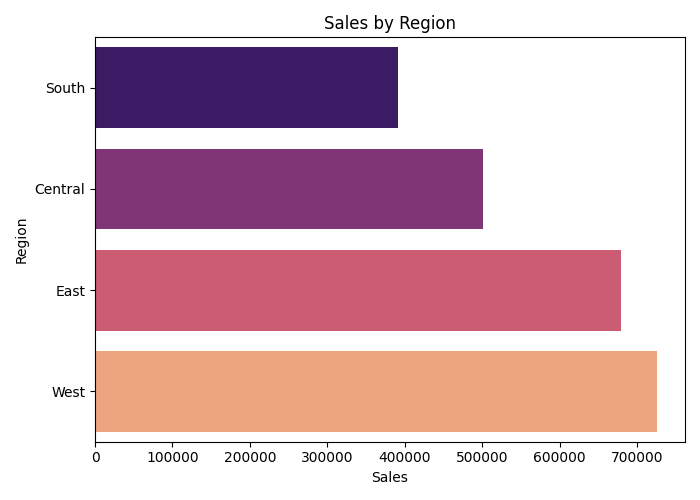

# Retail Sales Analysis

This project performs a comprehensive analysis of a retail store's historical sales data to identify key trends, top-performing categories, and regional sales distribution. The insights can help businesses make data-driven decisions to optimize operations, product offerings, and regional strategies.

# Project Overview

- Objective: Analyze retail sales data to extract business insights
- Dataset: [Sample Superstore Dataset](https://www.kaggle.com/datasets/juhi1994/superstore)
- Tech Stack: Python, Pandas, Seaborn, Matplotlib
- Output: Visual charts and summaries saved in "outputs/" folder

# Libraries Used

- "pandas"
- "matplotlib"
- "seaborn"
- "openpyxl" (for Excel file support)

Install all dependencies:
bash
pip install -r requirements.txt

# Project Structure

Retail-Sales-Analysis/
├── sales_analysis.py          # Main Python script for analysis and chart generation
├── Sample - Superstore.xlsx   # Raw sales data (Kaggle dataset)
├── requirements.txt           # Python dependencies
├── README.md                  # Project overview and documentation
└── outputs/
    ├── top_categories.png     # Top product categories by sales
    ├── monthly_trend.png      # Sales trend over time
    └── regional_sales.png     # Sales performance by region

# Key Insights

- Top Categories: Visualized total sales by product category
- Monthly Trend: Line chart shows sales fluctuation across months
- Regional Sales: Bar chart to compare revenue by geographical region

# Sample Visualizations

# Top Categories

# Monthly Sales Trend

# Regional Sales

# How to Run This Project

1. Clone the repository:

   git clone https://github.com/your-username/Retail-Sales-Analysis.git
   cd Retail-Sales-Analysis

2. Install dependencies:
   
   pip install -r requirements.txt
   
3. Run the analysis:
   
   python sales_analysis.py
   
4. View the generated charts in the `outputs/` folder.

# Future Improvements

- Add customer segmentation
- Use interactive dashboards (Plotly or Tableau)
- Automate monthly report generation

# Author

Haroon Bashi
[GitHub](https://github.com/haroonbashi2514) | [LinkedIn](https://www.linkedin.com/in/haroon-bashi-3aa683215)

⭐️ Star this repo if you found it helpful!
